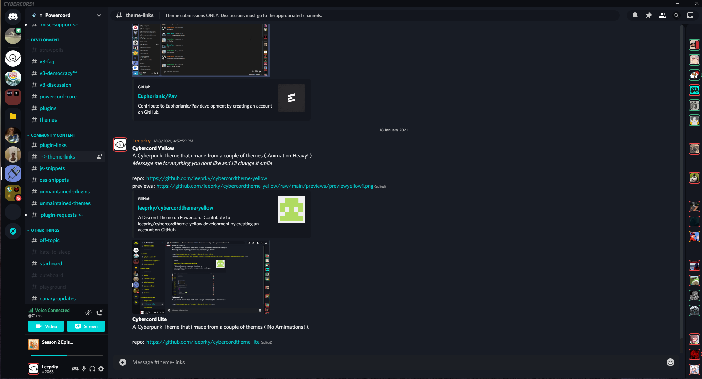
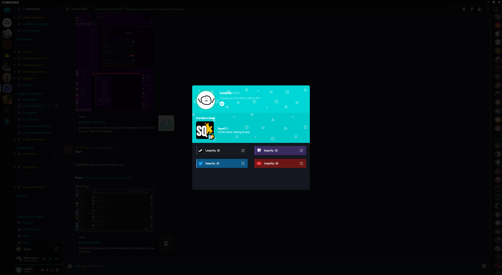

# cybercord
a A Discord Powercord Based CSS Theme.
its based on the midnightcord theme by madeleine#0173

this is my not my theme i have just edited and added a few snippits of css pretty much

## information

This Is the cyan version
If you wish to change the colours, there all in the theme.css

## install

Head to C:\Users\[USER]\powercord\src\Powercord

Right Click "themes" and click Git Bash Here

Type "git clone https://github.com/leeprky/cybercordtheme-CYAN"

Refresh Discord

## license

MIT, see LICENSE.md for more details

## previews

